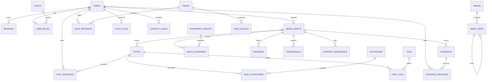

# iOrder V2 — Data model

## Mục đích

Đây là bản thiết kế dữ liệu trước khi tạo Drizzle schema và migration. Nó lấy
hành vi của V1 làm tham chiếu, nhưng không sao chép nguyên bảng hay kiến trúc
cũ. Một domain chỉ được tạo service, API và UI khi bắt đầu feature đó; database
model được chốt trước để các feature dùng chung một nguồn dữ liệu nhất quán.

## Quy ước chung

- PostgreSQL là source of truth cho nội dung CMS và dữ liệu vận hành website.
- Mọi bảng có `id`, `created_at`, `updated_at` dùng UUID do database sinh.
- Nội dung public có lifecycle chung:
  `draft → review → scheduled → published → archived`; xoá mềm dùng
  `deleted_at` khi cần giữ lịch sử.
- Nội dung editor soạn có revision là snapshot JSONB bất biến; revision không
  thay thế audit log.
- `audit_logs` chỉ ghi thêm, không được update/delete từ application.
- URL media không lưu cố định theo môi trường. Database lưu `storage_key`;
  storage service dựng `publicUrl` khi trả DTO.
- JSONB chỉ dùng cho cấu trúc biến thiên theo content type (block data, rich
  content, offering section, thông số thiết bị). Mọi JSONB đều phải có Zod
  schema trước khi đọc/ghi.

## Sơ đồ quan hệ



## Domain và bảng chuẩn V2

### 1. Identity and access

| Bảng | Trách nhiệm | Khoá/constraint chính |
| --- | --- | --- |
| `users` | tài khoản CMS | unique `username`, unique nullable `email`, `password_hash`, `full_name`, `status`, `last_login_at` |
| `roles` | vai trò (`admin`, `editor`…) | unique `code` |
| `user_roles` | quan hệ nhiều-nhiều user/role | primary key ghép `(user_id, role_id)` |
| `sessions` | server-side browser session | unique `token_hash`, FK `user_id`, `expires_at`, `revoked_at`, `last_seen_at`, IP hash/user agent |

Giữ nguyên nhu cầu V1. Session token luôn được hash trong database; cookie chỉ
giữ token raw với cờ `HttpOnly`, `Secure`, `SameSite` khi auth được xây.

### 2. Media

| Bảng | Trường nghiệp vụ |
| --- | --- |
| `media_assets` | `uploaded_by`, `storage_key` unique, `original_name`, `mime_type`, `file_size`, `width`, `height`, `alt_text`, `caption` |

`storage_key` là identity của object trong MinIO/S3. Không dùng đường dẫn local
hoặc URL hard-code làm canonical data.

### 3. Editorial: posts, news, guides

| Bảng | Trường nghiệp vụ |
| --- | --- |
| `posts` | `author_id`, `cover_media_id`, `type`, `title`, `slug`, `excerpt`, `content`, SEO fields, CTA, promotion window, `scheduled_at`, `published_at`, `deleted_at`, `view_count`, status |
| `post_revisions` | `post_id`, `editor_id`, `version_number`, snapshot, `change_note`, created time |
| `categories` | self-referencing `parent_id`, `name`, unique `slug`, `description`, `sort_order` |
| `tags` | `name`, unique `slug` |
| `post_categories` | post/category junction |
| `post_tags` | post/tag junction |

`type` gồm `news`, `promotion`, `case_study`, `announcement`, `guide`.
`slug` unique với post chưa xoá mềm. Index cần có `(status, published_at)` và
`(type, status)` để render public listing.

### 4. Product and service catalogue

| Bảng | Trường nghiệp vụ |
| --- | --- |
| `offerings` | `type`, cover, `title`, `slug`, `summary`, `content`, icon, status, sort/featured, SEO, schedule/publish/delete time |
| `offering_revisions` | offering/editor/version/snapshot/change note |
| `equipment_groups` | name, slug, description, cover, order, visibility and soft-delete time |
| `sales_equipment` | required equipment group, name, slug, model code, cover, `price_vnd`, warranty, summary, `specification_groups`, status, sort/featured, SEO, publish/delete time |
| `sales_equipment_revisions` | equipment/editor/version/snapshot/change note |

`offerings.type` là `software`, `solution`, `service`, `industry`; unique slug
theo cặp `(type, slug)`. `equipment_groups.slug` unique trong các nhóm chưa
xoá mềm; một thiết bị phải thuộc đúng một nhóm qua `sales_equipment.group_id`.

`content` và `specification_groups` được validate bằng Zod theo type/category;
không tạo bảng quan hệ chi li cho section hoặc thông số vốn thay đổi theo từng
sản phẩm.

### 5. CMS pages and homepage

| Bảng | Trường nghiệp vụ |
| --- | --- |
| `pages` | title, global unique slug, template, status, draft version, SEO, schedule/publish/delete time |
| `page_blocks` | `page_id`, block `type`, `sort_order`, `data`, `appearance`, `is_enabled` |
| `page_revisions` | page/editor/version/snapshot/change note/publish marker |

V2 **không có `content_pages` riêng**. FAQ, giới thiệu, terms, chính sách bảo
mật, hỗ trợ từ xa và homepage đều là `pages`; trang rich-text đơn giản dùng
block `rich_text`.
Điều này loại bỏ hai nguồn dữ liệu page trùng nhau của V1.

`page_blocks.type` là text, không phải PostgreSQL enum. Danh sách block được
quản lý bằng Zod để thêm block không cần migration; renderer chỉ nhận block đã
được schema parse. Bộ block khởi đầu kế thừa requirement V1: `hero`, `stats`,
`features`, `industries`, `ecosystem`, `process`, `testimonials`,
`partners`, `featured_posts`, `faq`, `cta`, `lead_form`, `rich_text`, `image`,
`download_list`.

Màn **Trang nội dung** trong CMS quản lý các block này bằng form theo từng loại:
thêm/xóa, bật/tắt, đổi thứ tự block và các mục con, chọn media cho block ảnh.
Editor không yêu cầu người vận hành nhập JSON; API vẫn validate toàn bộ payload
bằng `pageBlockInputSchema` trước khi ghi revision và xuất bản.

`lead_form` là block public duy nhất được quyền tạo `contact_leads`; nó gửi qua
API public, có trường honeypot chống bot và giới hạn một lần gửi trên mỗi địa
chỉ IP đã băm trong 15 phút. CMS chỉ đọc thông tin liên hệ và chuyển trạng thái
`new → contacted → closed`; mọi lần chuyển trạng thái tạo audit log.

### 6. Site navigation and configuration

| Bảng | Trường nghiệp vụ |
| --- | --- |
| `menus` | `name`, unique `location` (`main`, `footer-products`…) |
| `menu_items` | `menu_id`, self-FK `parent_id`, label, URL, target, icon, order, enabled |
| `site_profile` | unique profile key, company/legal name, contact information, logo media |
| `site_settings` | unique key, JSONB value, description, `updated_by` |
| `redirects` | unique source path, destination path, 301/308 status, enabled |

V2 **không có `link_groups`/`content_links` riêng**. Footer và navigation đều
là `menus` ở các `location` khác nhau. Một mô hình link giúp CMS và renderer
không phải quyết định nguồn dữ liệu riêng cho header/footer.

`redirects` chỉ nhận URL nội bộ bắt đầu bằng `/`, dùng mã `301` hoặc `308` và
được thực thi từ `src/proxy.ts` trước khi Next.js chọn route. Điều này bảo toàn
đường dẫn cũ khi chuyển nội dung từ V1 mà không mở ra redirect tới domain lạ.

`site_settings` còn giữ external links public (`appLogin`, `trial`, Facebook,
Zalo, YouTube, App Store, Google Play) và nội dung heading cho các listing public: catalog
(`software`, `solution`, `service`, `industry`) và listing (`news`, `support`,
`equipment`, `guides`). Khi thêm một key listing mới, contract phải có default
tương thích dữ liệu cũ và script seed phải chỉ bổ sung key thiếu, không ghi đè
nội dung CMS đang có.

Dashboard CMS hiển thị bảng **Sẵn sàng xuất bản**, đọc trực tiếp từ database:
tên miền/indexing, profile liên hệ, menu, trang, catalog, bài viết, thiết bị và
nội dung hỗ trợ. Đây là checklist vận hành; nó không tự thay đổi cấu hình hay
tự publish nội dung.

### Quy tắc editor CMS

Mọi dữ liệu có người vận hành trực tiếp chỉnh sửa đều dùng form nghiệp vụ,
không yêu cầu nhập JSON: trang/block, bài viết (đoạn văn và checklist),
offering, nhóm và thông số thiết bị, menu cây, chuyên mục/thẻ, đối tác/đánh
giá, tài khoản và cấu hình listing. JSON chỉ còn ở payload HTTP, JSONB trong
database và snapshot revision đọc-only. Đây là ranh giới bắt buộc khi thêm
module CMS mới.

| Nghiệp vụ CMS | Nguồn dữ liệu | Nơi xuất bản |
| --- | --- | --- |
| Trang và homepage | `pages`, `page_blocks` | `/`, `/trang/[slug]` và các route trang tĩnh |
| Catalog | `offerings` | `/phan-mem`, `/giai-phap`, `/dich-vu`, `/nganh-nghe` |
| Thiết bị | `equipment_groups`, `sales_equipment` | `/thiet-bi` |
| Bài viết và hướng dẫn | `posts`, taxonomy | `/tin-tuc`, `/ho-tro/cai-dat` |
| Header, CTA, footer | `menus`, `menu_items`, `site_settings` | layout public |
| Liên hệ, đối tác, đánh giá, tải về | domain tương ứng | page block và trang hỗ trợ |

Khi thêm một route public mới, phải xác định một dòng ownership tương ứng ở đây,
thêm contract/service CMS và không dùng nội dung static làm nguồn lâu dài.

Mỗi mutation nội dung public phải làm mới route listing, route chi tiết và
`/sitemap.xml` liên quan. Bài viết làm mới cả `/tin-tuc` và `/ho-tro/cai-dat` vì một
bài có thể đổi loại; catalog làm mới route theo `type`. Layout public dựng
structured data `Organization`/`WebSite` từ profile, cấu hình xuất bản và liên
kết ngoài của CMS; không hard-code tên miền V1.

`/admin/**` luôn có metadata `noindex, nofollow`, độc lập với cờ indexing của
website public. `robots.txt` cũng chặn `/admin/` và `/api/` khi indexing được
bật.

## Khởi tạo dữ liệu CMS

Sau `pnpm db:migrate`, chạy `pnpm db:seed:cms` để tạo tài khoản, trang,
navigation, cấu hình và redirect nền tảng. Chạy `pnpm db:import:v1-content`
khi cần nhập lại nội dung công khai V1. Các script đều idempotent: chúng chỉ
tạo hoặc bổ sung cấu hình thiếu, không ghi đè nội dung đã sửa trong CMS.

### 7. Supporting content and business input

| Bảng | Trường nghiệp vụ |
| --- | --- |
| `partners` | logo media, kind (`partner`/`customer`), name unique, description, website, order, enabled |
| `testimonials` | avatar media, author/company, quote, rating, order, enabled |
| `support_downloads` | file media, icon, title, description, meta, order, enabled |
| `contact_leads` | name, phone, email, business model, branches, need, message, lead status, IP hash, handler/time |
| `audit_logs` | user, action, entity type/id, before/after snapshot, IP hash, created time |

## Quyết định V1 → V2

| V1 | V2 | Lý do |
| --- | --- | --- |
| `content_pages` + `pages/page_blocks` | chỉ `pages/page_blocks` | Một canonical page model, rich text là block. |
| `link_groups/content_links` + `menus/menu_items` | chỉ `menus/menu_items` | Header/footer đều là navigation links theo location. |
| equipment category enum | `equipment_groups` + required `sales_equipment.group_id` | CMS có thể tạo, ẩn và sắp xếp nhóm thiết bị. |
| `media_assets.public_url` | không lưu canonical URL | URL phụ thuộc MinIO/S3/CDN environment; storage key mới bền. |
| Post/offering/equipment revision tables | giữ riêng | Snapshot và rule mỗi domain khác nhau; không dùng polymorphic revision thiếu FK. |
| Homepage module riêng | page có `template = home` | Cùng lifecycle/revision/block engine với trang CMS khác. |
| Page block PostgreSQL enum rất dài | `text` + Zod discriminated union | Thêm block không đòi migration nhưng vẫn runtime-validated. |

## Index và integrity tối thiểu

- Mọi FK có hành vi xoá chủ động: nội dung giữ lại khi user/media bị xoá
  (`set null`); child sở hữu của parent như revision/block/junction dùng
  `cascade`.
- Unique: user name/email, role code, storage key, active content slug, page
  slug, taxonomy slug, menu location, setting key, redirect source path.
- Listing public: index theo content status/published time; catalog theo
  type/category + status + sort order; record enabled theo sort order.
- Junction post taxonomy dùng primary key ghép để không tạo liên kết trùng.
- Giá tiền thiết bị lưu `bigint price_vnd`, không dùng float.

## Thứ tự tạo migration

```text
001 extensions + shared enums
002 users, roles, user_roles, sessions
003 media_assets
004 site_profile, site_settings, redirects, audit_logs
005 menus, menu_items
006 posts, categories, tags, junctions, post_revisions
007 offerings, offering_revisions
008 sales_equipment, sales_equipment_revisions
009 pages, page_blocks, page_revisions
010 partners, testimonials, support_downloads, contact_leads
```

Migration phải được review SQL trước khi chạy. Migration đầu tiên bật extension
`pgcrypto` để UUID database-generated luôn dùng được. Database có đủ model sau
bước 010, nhưng V2 vẫn chỉ implement service/API/UI theo từng vertical slice.

## Feature implementation order sau database

1. Auth foundation: users, roles, sessions.
2. Posts: public read trước, sau đó CMS editor khi auth đã có.
3. Offerings: software/solution/service/industry.
4. Page blocks/homepage.
5. Media, equipment, navigation/settings, supporting content và leads.

Mỗi feature phải có Zod input/output contract, repository, service, route
handler (nếu client/external consumer cần HTTP), public renderer và test trước
khi bắt đầu feature kế tiếp.
